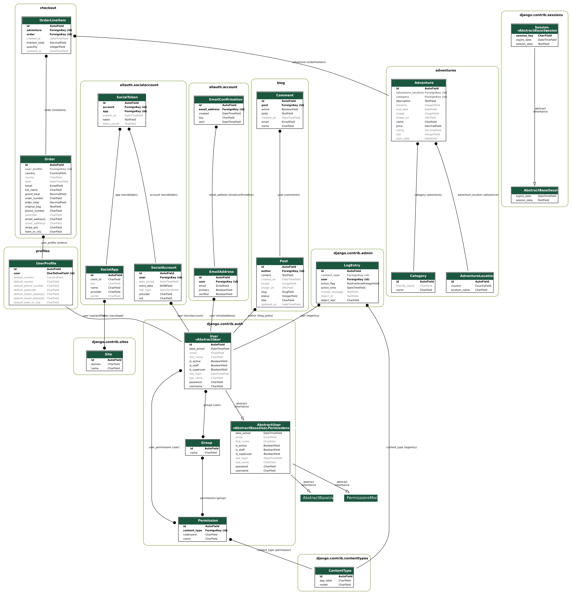

# [Explore More Adventure Agency](https://explore-more-adventures-ms4.herokuapp.com/)

 Code Institute - Full Stack Frameworks with Django Milestone Project 4

<h1 align="center">
  
</h1>

<h2 align="center">
Explore More Adventure Agency   
</h2>

 

A site to explore a wide range of adventure packages and book your trip of a lifetime. Explore More aims to emulate a holiday package 
site which provides adventure seekers a variety of locations to visit and participate in a range of activities. 
The Explore More app was designed, developed and deployed but Louise Hynes for 
educational purposes as part of her final preject for the Code Institute Software Development diploma.
 
In Phase one we are focusing on pre-made packages with the intention to build on this 
and allow users to create their own custom adventure packages.  
 
[Click here to view the page now!](https://explore-more-adventures-ms4.herokuapp.com/)

## Table of Contents

1. [**UX**](#ux)
    - [Project Goals](#project-goals)
        - [User Stories](#user-stories)
        - [Site Owner User Stories](#site-owner-user-stories)
        - [Developer and Business Goals](#developer-and-Business-Goals)
    - [Design choices](#design-choices)
    - [Wireframes](#wireframes)

2. [**Features**](#features)
    - [Current Features](#current-features)
    - [Future Features](#future-features)

3. [**Database**](#database)
    - [Database choice](#db-choice)
    - [Database structure](#db-structure)

4. [**Technologies Used**](#technologies-used)
    - [Languages](#languages)
    - [Frameworks, Libraries and Programs](#frameworks,-libraries-and-programs)

5. [Testing](#testing)

6. [Deployment](#deployment)
    - [Heroku Deployment](#depl-heroku)
    - [Local Deployment (GitPod)](#depl-gitpod)
    - [Bugs](#bugs)

7. [Credits](#credits)
    - [Content](#content)
    - [Media](#media)
    - [Code](#code)
    - [Acknowledgements](#ack)

# UX

## Project Goals

The primary goal of *Explore More(EM)* is to provide a clean, intuitive and engaging web app is to provide customers with an online platform to book their next big adventure. 

EM has two key target audiences: New Adventure Seekers/explorers and returning customers.
 People who want to make a relax or spiritual trip.
- People who are looking for the best locations.

**Project stakeholders**
- Adventure Seekers (Customers) – the agency offers recreational activty based adventures to individuals.
- Agency (Site Owners) – Explore More Adventure Agency the agency offers CHANGE travels for businesses and scientists for research purposes.

## User Stories

**New/Unregistered User**

The first impression of a site for any new potential customer is very important. With that in mind new visitros to the EM site want to: 
* Learn more about the EM Agency to know more about the team and the services provided via an about page
* Easily at first glance get an overview of the type of adventure packages avaialbe from the agency 
* Read more information and view  details of any particular adventure t better understand whats included in the package.
* Easily register for an account to update personal profile for quicker ordering in the future

**Registered User**

Additional permissions and features will be provided to registered users. A registered user will want to: 
* Easily log in and out of their account to access personal information and order history
* Edit profile information to update personal details
* View past orders to keep track of history with the site
* Save my billing details to autopopulate the form on checkout

**All Users**

All customers and visitors of the Explore More site - new, returning or registered users want to: 
* Discover more about the adventure packages based on activity caegory
* Easy access to all the adventure packages the EM agency offers
* A visually and operationally appealing site that makes if simple to learn more about various adventures
* Easily view the details of a specific adventure.
* Search for an adventure or activity category by its keyword and receive a feedback by the website if it isn't available.
* View the top 3 adventures at the time of browsing
* Contact the EM site owner to ask them a question
* Learn more about different adventures through blog articles, reviews and comments. 
* Sort the packages available on the site by category so that I can view just the products in that category.
* Wnen selecting an adventure package choose the number of people to be added and update the cart accordingly 
* Add a package to my cart to order chosen adventure package
* Update the number of items in my cart to order more or less of the chosen item
* Delete products from my cart to empty it or update the price total where relevenat
* Checkout with credid card using a secure payment method to complete order
* Get updated interactive messages so their is clear feedback on any action i.e. form completion,cart updated, payment processed etc. 
* Checkout in a simple and easy way with confirmation the process has been successful or other. 
* Receive an order confirmation

## Site Owner User Stories

EM adventure agency wants a site that will: 
* Excellently display their adventure packages and  help sell as many via an easy and simple process.  
* Make sure the customers are aware of the different advnetures available to them.
* Be easy to manage and have the ability to simply add, update and delete items. 

**Site owner/Admin goals:**

A site owner or admin wants to: 
* Easily list all adventures for sale and view all adventure package listings
* Create, edit, update adventure pacakages and categories - ensuring all information is correct
* Delete and packages or categories from the site
* Educate customers about the different options of adventures avialable and encourage them to engage via the site. 
* View and update all blog posts via the admin panel and update from draft to published when ready to share on the site
* Send email confirmations to users to them of successful registration and order confirmation.

## Developer Goals

- A well designed directory of adventure holiday pacakges that strives to engange new costomers to and envourage them to book a package with the company thus increasing revenue. 
- Good and clean programming that is robust and scaleable with the increase of adventure categories and locations. 
- A professional looking first attempt of building a full stack application with Django which the developer is excited to make a part of her portfolio and continue to develop in the future

## Design Choices

The goal with the look and feel of the site was to have a design that was simple, clean and engangeing. 
Where tuhe imagery of the adventures jumped out to the visitor. 
I reviewed some bootstrsp themes for inspiration 
- [Agency](https://startbootstrap.com/previews/agency)
- [Clean Blog](https://startbootstrap.com/previews/clean-blog)
- [Grayscale](https://startbootstrap.com/themes/grayscale/). I found it absolutely wonderful and I tried my best to stick to the theme while building my website.
The following design choices were made with this in mind:

**Fonts**

- The primary font **Roboto** was chosen because it is a crisp, sharp and easy to read font. It was inspired by the logo created on [Canva.com](https://www.canva.com/design/DAEZS9oLjqo/ORIPu67YhJCYB8cCxHwt_Q/view?utm_campaign=designshare&utm_source=sharebutton) 

**Colours**

- The primary colour choices for this site is navy and tourqupise. Inspired but the sea and also my brothers old scounts uniform of blue and navy. 

**Styling**

- On the listing page cards have a minimalist design
- Design and styting consistency was important on this site to help linking and combining the related areas together. 

**Adventure Tile Images**

- At present these have been kept simple and their layout will be considered again in the future. 

**Header and home Banner images**

- A strong header was chosen to make the logo and heading memorable 
- The homepage image was chosen to envoke a sense of the wild. 

### Wireframes

During the early part of the project wireframes were created using pen and paper and on [Pages](https://www.apple.com/pages/). 

- [Link](https://drive.google.com/drive/folders/1E-GPI5uT55XETPIjipmbFOIiUjZFPJ0j?usp=sharing)

# Features

## Current Features

###### Features on every page
- Fixed navigation bar with:
    - the logo on the left 
    - centered in the middle links to the different pages
    - links for account pages and cart planced on the rights
- Footer with the name of the company and representative social media links

###### Feature 1 - Home page
Home page with:
- Insights to Explore more 
    - Top adventures available to cusotmerts
    - reviews from customers
    - Feature story
    - contact information for the main office

###### Feature 2 - About page
- A simple page with information about the company.

###### Feature 3 - Contact page
- A simple page with contact form and the google map location of the company.

###### Feature 4 - Blog page
- List page overview of all adventure blogs
- Detail page for each blog and option for visitor to leave a comment

###### Feature 5 - Adventures Page
- Presentation of all the adventures available. 
- Search feature in the hero header Banner
- Sorting by catagory 
- For each package, the following information is provided:
    - The dates of the adventure
    - the cost 
    - the activity category
    - CTA button to access the aadventure details

###### Feature 6 - Adventure details
Description page for a specific adventure. The page displays many items such as: 
- Image of the adventure
- Description of the package information
- Activity catagory
- Rating
- Select a quantity of adventure package
- CTA button to add to cart
- CTA button to go back to explore other adventures

###### Feature 7 - Cart page
The shopping cart is available anywhere in the site. 
The cart page should display all the packages in the user's cart. 
For each item in the cart, the following information should be available:
- Adventure Name 
- Start and End dates
- Price
- Quantity of passengers and subtotal
- total price of the cart
- CTA button to proceed to checkout
- CTA button to go back to explore other adventures

###### Feature 8 - Checkout
Checkout process:

- Left
    - contact details form
    - If not logged in option to create account and save information
    - Stripe payment form
- Right
    - Order summary
- End - confirmation of order via toast message

###### Feature 9 - Sign up page
Sign up form to register to an account.

###### Feature 10 - Login page
Form to log in to your account.

###### Feature 11 - Password reset page
Option to reset password by email in case users forgot it.

###### Feature 12 - Profile page
Profile page for users with an account that should display their:
- Personal contact details
- Option to change their password
- Order History

###### Feature 13 - Order Summary page
Page with all upcoming and/or past trips that were booked by the user.

###### Feature 14 - Log out confirmation

## Future Features 

###### Create your own adventures

I would love to give cusomters to build out their own unique adventures

###### Blog CRUD on site

To make it easier for more admin I'd like to give a superuser the option to create a blog right on the site

###### Rich Text Fields

For adventure description and blogs I would liket to update this field to rich text to allow more flexiblity to create more engaging content. 

# Database

## Database choice

- Development: I used sqlite3 database which is the default database provided by Django. 
- Production: I used PostgreSQL for my deployed application hosted on Heroku. 

## Database structure

- The data consists of 8 models accross 9 apps
- The relation of the models are displayed in the image below
    

# Technologies Used

## Languages & Testing Tools

##### [HTML5](https://www.w3.org/TR/html/)
- HTML used to create the static content of site

##### [CSS3](https://www.w3.org/Style/CSS/)
- CSS used for styling of site  

##### [JavaScript](https://developer.mozilla.org/en-US/docs/Web/JavaScript)
- Core JS was used throughout the site

##### [Python 3](https://www.python.org/downloads/release/python-374/)
-Python 3 as the back-end programming language for my application.

## Frameworks & Libraries

### Frameworks, Libraries and Programs Used
- Front-End
    - [Bootstrap 5.0](https://getbootstrap.com/)
        -  Used for the responsive layout as well as the navigation, header, footer, forms, dropdowns, item cards, modals.
    - [Font Awesome](https://fontawesome.com/)
        - Font Awesome was used for all icons
    - [Google Fonts](https://fonts.google.com/) 
         Google Fonts was used to import 'Roboto' font in the style.css file.
    - [jQuery 3.5.1](https://jquery.com/) - Used in stripe javascript logic

- Back-End
- [Django](https://www.djangoproject.com/) 
    - used as the main framework to build the project
- [Stripe](https://stripe.com) 
    - used to facilitate single payments and subscription plans
- [Psycopg2](https://pypi.org/project/psycopg2/)  
    - used to allow postgresSQL to be used with python
- [Django Crispy Forms](https://django-crispy-forms.readthedocs.io/en/latest/) 
    - used to display forms
- [Gunicorn](https://pypi.org/project/gunicorn/)  
    - deployment tool
- [Boto3](https://boto3.amazonaws.com/v1/documentation/api/latest/index.html)  
    - aid the deployment of AWS S3
- [Pillow](https://pillow.readthedocs.io/en/stable/) 
    - image proccessing tool in python
- [pip3](https://pip.pypa.io/en/stable//)  
    - used to install all packages in python
- [SQlite3](https://www.sqlite.org/index.html) 
    - used as a database in development
- [PostgreSQL](https://www.postgresql.org/) 
    - used as a database in deployment
- [AWS S3](https://aws.amazon.com/)  
    - used to store images and static files displayed in the deployed site
- General
    - [Git](https://git-scm.com/) - Git was used to allowing for tracking of any changes in the code and version control.
    - [Github](https://github.com/) - GitHub is used to host the project files.
    - [TinyPNG](https://tinypng.com/) - Used to minify and compress images.
    - [Heroku](https://dashboard.heroku.com/apps) - A cloud platform used to deploy the web application.
    - [Canva](https://www.canva.com/) - logos and image

# Testing 

**User Story Testing**

To test this project I asked fmaily and freinds to compete the tasks set out in the user-stories section of this README.above. 

**Manual Testing**

Site responsiveness was tested by leveraging the chrome deice emulator and also 
on different devices na doperating systems including: 
-  3 desktop browsers (Chrome, Safari and Firefox) 
- 1 tablet on 2 browsers (Chrome and Safari) 
- Google Pexel phone on Chrome

**Automated Testing**

Unfortunately on this occasion I was unable to add automated testing due to time constraints but will add in future as this is best practice.

**Language Testing**

##### [HTML5](https://www.w3.org/TR/html/)
- HTML Testing - [code validator](https://validator.w3.org/)

##### [CSS3](https://www.w3.org/Style/CSS/)
- CSS Testing [code validator](https://jigsaw.w3.org/css-validator/) 

##### [JavaScript](https://developer.mozilla.org/en-US/docs/Web/JavaScript)
- JS code testing [JSHint](https://jshint.com/)

##### [Python 3](https://www.python.org/downloads/release/python-374/)
*PEP8 Compliant Testing* to ensure all .py files were PEP8 compliant

# Deployment

## Heroku

My application was deployed through [heroku](https://dashboard.heroku.com) using the master branch of my github repository for this project. The following steps were implemented to deploy this project:

1. Install **gunicorn** package to run the application on Heroku.
    - `sudo pip3 install gunicorn`
2. Install **pycopg2** to connect to PostgreSQL
    - `sudo pip3 install psycopg2`
3. Create a **requirements.txt** file
    - `sudo pip3 freeze --local > requirements.txt`
4. Create a new Heroku application
    - Sign up to a new account if you do not already have one.
    - Create a new application by clicking on `new` then `create new app`.
    - Set the name of your application and select your region and click on `create app` to finalize the creation of your app. 
5. Install PostgreSQL add-on
    - `heroku addons:create heroku-postgresql:hobby-dev`
6. Create a **Procfile** in the root directory
    - content: `web: gunicorn CHANGEx.wsgi:application`
7. Set the following config variables as environment variables:

Config Vars | Value
----------- | -------------
AWS_ACCESS_KEY_ID | `<AWS_ACCESS_KEY_ID>`
AWS_SECRET_ACCESS_KEY | `<AWS_SECRET_ACCESS_KEY>`
DATABASE_URL | `<DATABASE_URL>`
EMAIL_HOST_PASSWORD | `<EMAIL_HOST_PASSWORD>`
EMAIL_HOST_USER | `<EMAIL_HOST_USER>`
EMAILJS_USER | `<EMAILJS_USER>`
HOSTNAME | `<HOSTNAME>`
SECRET_KEY | `<SECRET_KEY>`
STRIPE_PUBLISHABLE | `<STRIPE_PUBLISHABLE>`
STRIPE_SECRET | `<STRIPE_SECRET>`
USE_AWS | `<TRUE>`

8. In the `Deploy` tab, choose `Connect Github` as **Deployment Method** and *Enable Automatic Deployment* from the Github master branch so that any new commit will be automatically deployed through your heroku app. 

## Local Deployment (GitPod)

To deploy this project locally using gitpod you will have to create a gitpod account and use a web browser with a stable internet connection as gitpod is an online IDE. I suggest you use Chrome as web browser so that you can use gitpod chrome extension to speed up the deployment process. 

1. Create a Gitpod account (if not already)
    - Go to [GitPod](https://www.gitpod.io)
    - Click on `Go to App` and click on the green `Authorize gitpod.io`
    - Agree to the terms and then create your free account
2. Add gitpod browser extension for Chrome:
    - Go to [GitPod Chrome Browser Extension](https://chrome.google.com/webstore/detail/gitpod-online-ide/dodmmooeoklaejobgleioelladacbeki)
    - Search for "gitpod" in chrome web store search bar
    - Click on `Add to Chrome` then click on `Add to extension`
3. Clone this project repository from github
    - Go to my [repository](https://github.com/CHANGEiaDelorme/project-CHANGEx) for this project.
    - If you successfully installed the gitpod browser extension you should view a green `Gitpod` button in the top right corner of the repository (next to `Clone or download` button). Click the `Gitpod` button. 
    - This will allow you to open this repository directly in gitpod for editing.
4. Set the following environment variables for the project:

Env Vars | Value
----------- | -------------
SECRET_KEY | `<SECRET_KEY>`
STRIPE_PUBLISHABLE | `<STRIPE_PUBLISHABLE>`
STRIPE_SECRET | `<STRIPE_SECRET>`

5. The default local database for django projects is SQLite 3.
6. Download all the dependencies necessary to run this project and listed in the **requirements.txt** file. 
    - Run the following command `pip3 install -r requirements.txt`
7. Create a local development server:
    - In the workCHANGE run the following command `Python3 manage.py runserver`.
    - You should now have a gitpod link to the deployed app. 

## Bugs

### DB & Images
In the final two days before submission I had a issue with my Postgress DB which resulted in a full reset of the DB. 

There also appears to be glitched wtih AWS as the images are on the site but at random choose to show or hide different images - given the time I will review this issue further. 

I would like to thank the tutors for their support but we were unable to resolve or find a resolution to the issue in the given time. 

# Credits

### Media

- I created the logo of this website thanks to [Canva.com](https://www.canva.com/design/DAEZS9oLjqo/ORIPu67YhJCYB8cCxHwt_Q/view?utm_campaign=designshare&utm_source=sharebutton) 
- All the images used for this project were found on
    - [Pexels](https://www.pexels.com)
    - [Canva.com](https://www.canva.com/)
- I used [Font Awesome](https://fontawesome.com/v4.7.0/icons/) for my icons.

### Code
- [Collapsable](http://jsfiddle.net/hungerpain/eK8X5/7/)
- [Corey Schafer's Django Tutorials](https://www.youtube.com/playlist?list=PL-osiE80TeTtoQCKZ03TU5fNfx2UY6U4p)

### Blog Implementation Tutorial

For the blog models I drew inspiration from the following tutorials

[Blog App](https://djangocentral.com/building-a-blog-application-with-django/)

[Blog Comments](https://djangocentral.com/creating-comments-system-with-django/)

[Blog Pagination](https://djangocentral.com/adding-pagination-with-django/)

### Acknowledgements
- I would like to greatly thank my Code Institute mentor, Reuben Ferrante, for his guidance, advice and support over the course of this project. 
- A huge thanks to all the tutors at Code Institute for their great support and patience.
- Finally my partner Michael and family for keeping my spirits high and supporting me along the way with tea and site testing.